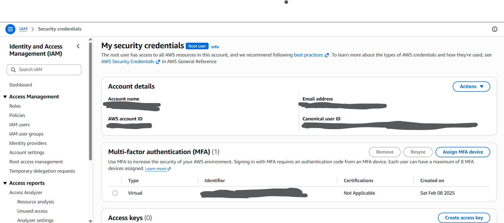
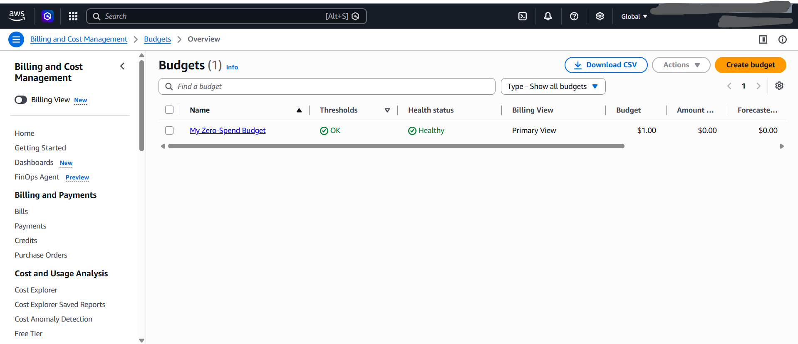
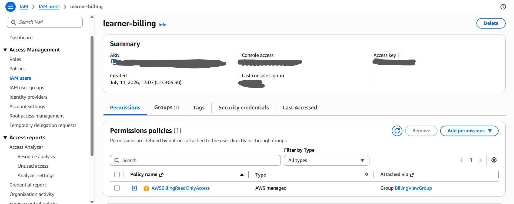
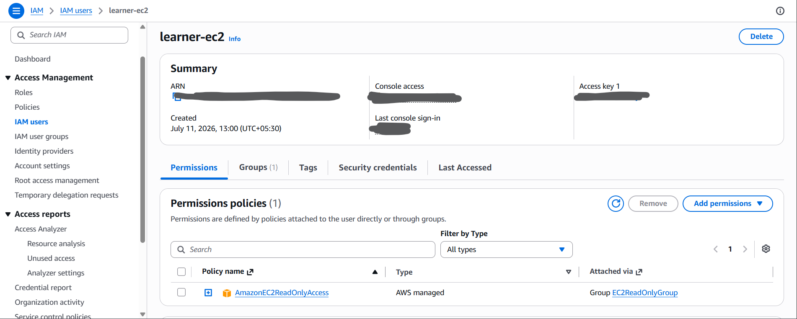
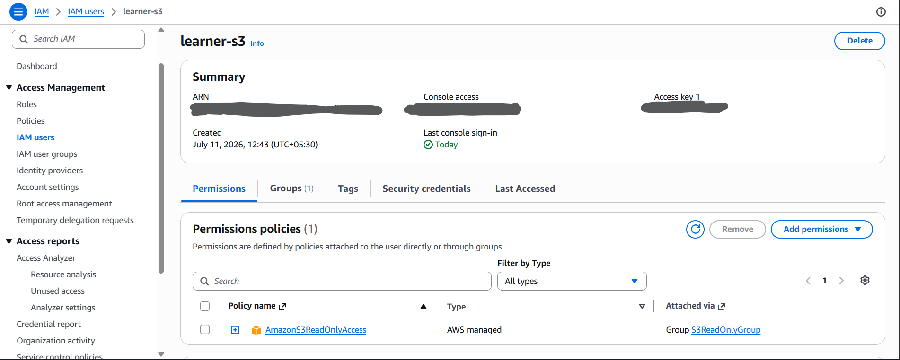
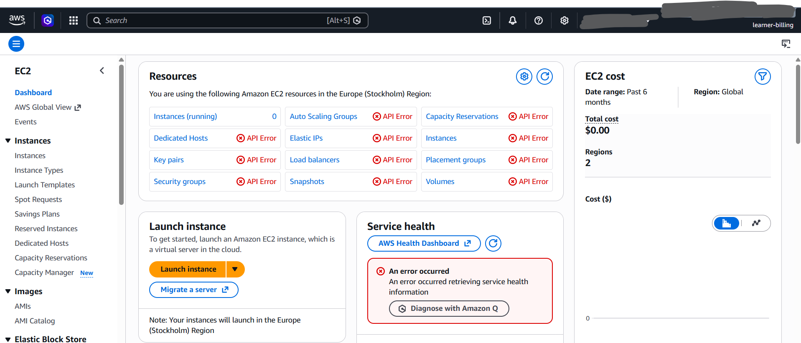
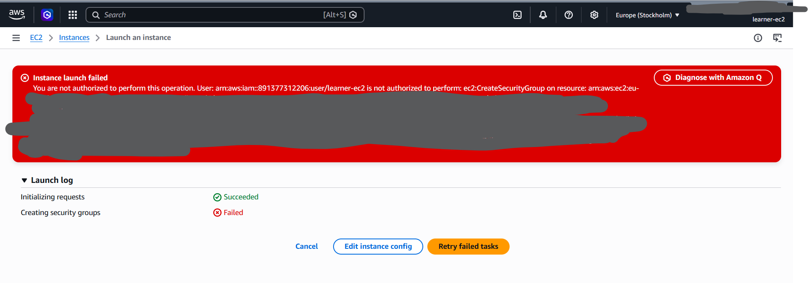
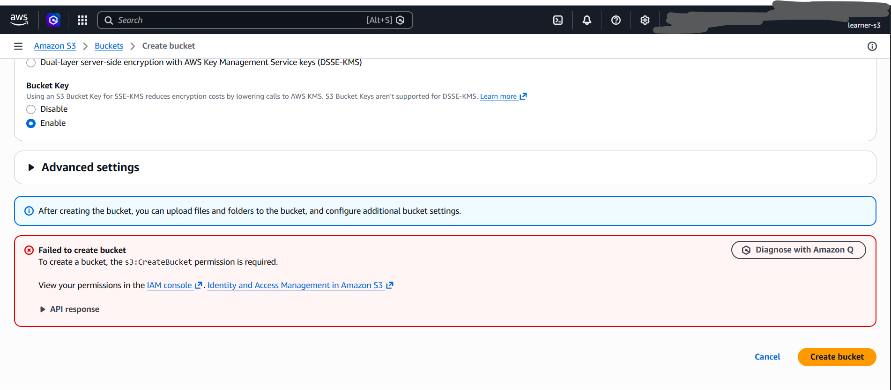
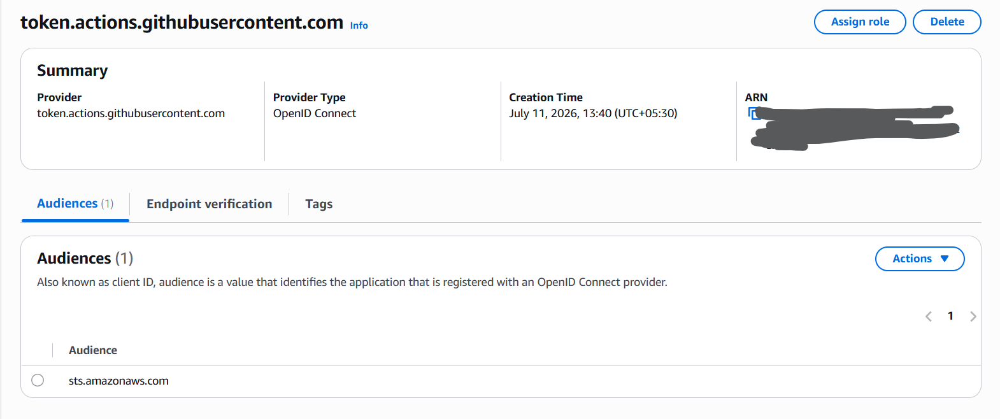
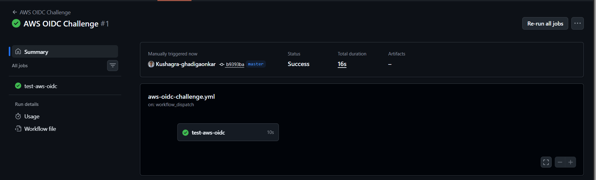

# Week 1 - IAM Challenge

## Name
Kushagra Ghadigaonkar

## LinkedIn Post
[LinkedIn Link]()

## Tasks Completed
- [x] Root MFA
- [x] Billing alert
- [x] IAM users and groups
- [x] IAM policies
- [x] Least privilege
- [x] GitHub OIDC

## What I Learned
Today I learned how IAM controls access in AWS.
1. To create groups
2. To create user and attach to groups
3. To attach policies and Policy boundaries
4. To create and use OIDC

## Screenshots Added
- Root MFA
    

- Billing alert

    

- IAM group,user and policy

    
    
    

- Access denied

    
    
    

- Oidc Challenge

    
    
