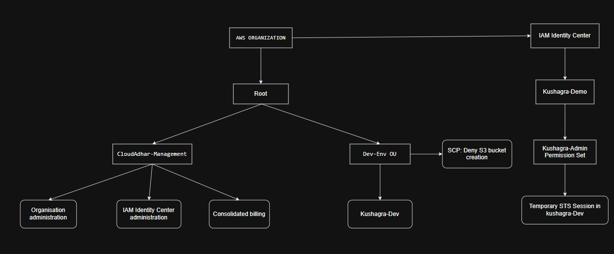
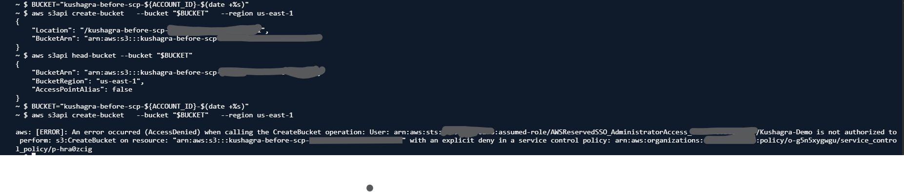

# Week 2 - Day 4: AWS Organizations, SCPs, and IAM Identity Center

## Name
Kushagra

## Topics Practiced
1. Aws Organisation
2. Iam identity center
3. Scp

### Organization, Root, Management Account, Member Account, and OU
- An **AWS Organization** is used to manage multiple AWS accounts from one place.
- The **Root** is the top level of the organization hierarchy.
- The **Management Account** creates and manages the organization, billing, and policies.
- A **Member Account** is an AWS account that belongs to the organization and is managed by the management account.
- An **Organizational Unit (OU)** is a container used to group member accounts and apply policies such as SCPs.

### Why an SCP is a Guardrail Rather Than a Permission Grant
- An **SCP (Service Control Policy)** does not grant permissions.
- It sets the maximum permissions that accounts in an OU can have.
- Even if an IAM user or role is allowed to perform an action, the action is denied if an SCP explicitly blocks it.

### Why IAM Identity Center is Preferred Over Duplicate IAM Users
- IAM Identity Center provides centralized access management for multiple AWS accounts.
- Users can sign in once and access the accounts they are assigned to.
- This avoids creating and managing separate IAM users in every AWS account, improving security and simplifying administration.

### Difference Between a Permission Set and an SCP
- A **Permission Set** defines what actions a user can perform after signing in through IAM Identity Center.
- An **SCP** defines the maximum permissions allowed for AWS accounts within an organization.
- Permission sets grant access, while SCPs only restrict access.

### Why S3 Bucket Creation Worked Before the Account Move and Failed Afterward
- Before moving the account into the **Dev-Env OU**, there was no SCP restricting S3 bucket creation, so the permission set allowed the action.
- After moving the account into the **Dev-Env OU**, the SCP explicitly denied `s3:CreateBucket`.
- Because explicit deny takes precedence over allow, bucket creation failed.

### What I Learned About Consolidated Billing
- Consolidated billing combines charges from all member accounts into a single bill managed by the management account.
- Each account remains separate, but billing is centralized.
- It makes cost tracking easier and can help organizations benefit from shared discounts and pricing tiers.

## LinkedIn Post
[LinkedIn Link](https://www.linkedin.com/posts/kushagra-ghadi_10weeksofaws-aws10weekchallenge-cloudadhar-ugcPost-7481637798672748544-rown/?utm_source=share&utm_medium=member_desktop&rcm=ACoAAEdd1JEBGLKm2xnLGzZYAectlvG9YGy5c3A)

## Minimum Accepted Submission

- Organisation Architecture
    

- S3 Before-scp

    .png)

- S3 After-scp
    
