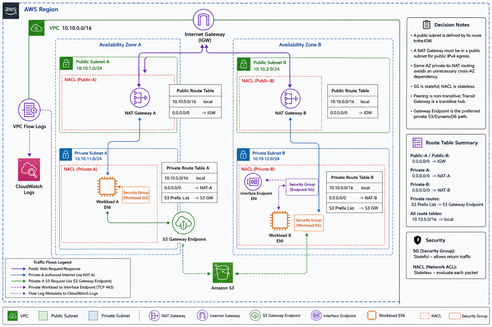
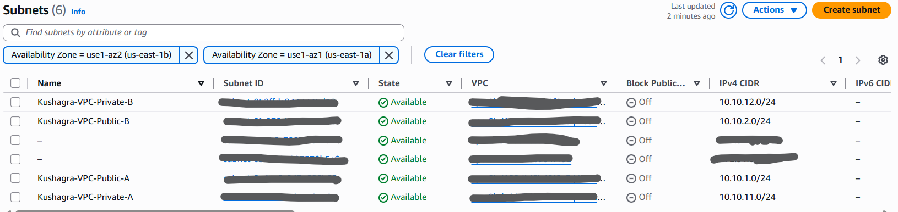
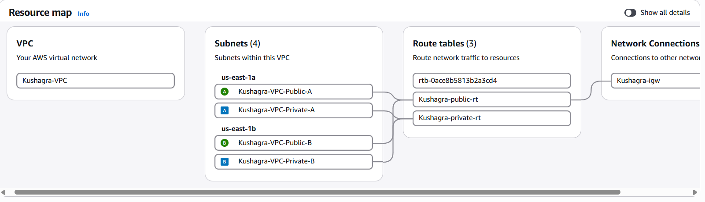
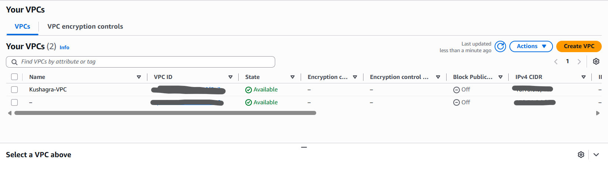

# Week 3 - Amazon VPC

## Name
Kushagra

## Architecture
Explain the two-AZ VPC and add your diagram.
-> Vpc are used to isolate and manage aws architecture securely . so availablity zone are used to declare vpc to available aws service of that particular application for that zone

## ScreenShots
 - Subnets used :

 

 - Vpc-Map :

 

 - Vpc :

 

## LinkedIn Posts
[LinkedIn Link]()
