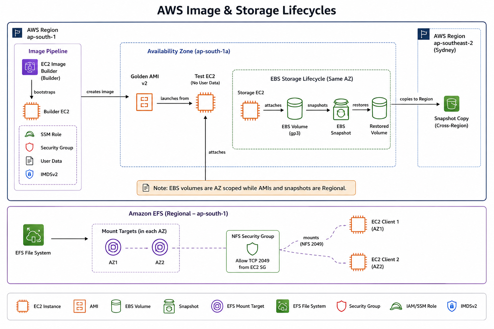

# Week 4 - EC2 Essentials, EBS, and Pricing

## Learner
- Name: Kushagra
- GitHub: https://github.com/Kushagra-ghadigaonkar
- LinkedIn: https://www.linkedin.com/in/kushagraghadi/
- Region: Mumbai

## Day 7
- Instance selection:
- User Data result:
- IMDSv1 expected-deny:
- IMDSv2 result:
- Golden AMI validation:
- Pricing decisions:

## Architecture Decision

### Decision Table

| Requirement | Choice | Reason |
|-------------|--------|--------|
| Repeatable patched nginx baseline | Golden AMI | Provides a versioned, reusable operating system image that launches identical EC2 instances every time. |
| Automated image pipeline | EC2 Image Builder | Automatically builds, patches, validates, and versions AMIs. |
| Secure instance administration | Session Manager | Enables shell access without opening SSH ports or managing key pairs. |
| Token-based metadata | IMDSv2 Required | Protects instance metadata using session tokens, reducing SSRF risks. |
| General application block storage | gp3 | Cost-effective SSD storage with independent IOPS and throughput scaling. |
| Critical provisioned IOPS | io2 Block Express | Delivers very high IOPS, throughput, and low latency for critical workloads. |
| Shared files for Linux instances across AZs | Amazon EFS | Provides Regional shared file storage accessible from multiple EC2 instances. |
| Same-AZ cluster-aware shared block device | io2 Multi-Attach | Allows multiple EC2 instances in the same AZ to share a single EBS volume. |
| Temporary reproducible cache | Instance Store | High-speed ephemeral storage that disappears when the instance stops or terminates. |
| Tightly coupled HPC | Cluster Placement Group | Places instances close together for ultra-low network latency. |
| Critical instance isolation | Spread Placement Group | Separates instances across distinct hardware to reduce correlated failures. |
| Rack-aware Kafka | Partition Placement Group | Distributes instances across logical partitions while keeping each partition close together. |

---

# Pricing Scenarios

| Requirement | Recommended Option | Reason |
|------------|--------------------|--------|
| A new API has unpredictable demand | On-Demand Instances | Pay only for the compute used without long-term commitments. |
| A checkpointed rendering fleet tolerates interruption | Spot Instances | Lowest cost for interruption-tolerant workloads. |
| A company has steady compute spend across services | Compute Savings Plans | Provides discounts across EC2, Lambda, and Fargate with flexible usage. |
| Licensed software requires physical-host visibility | Dedicated Hosts | Offers visibility and control over the underlying physical server. |
| A stable fleet uses the same EC2 family in one Region | Reserved Instances | Lowest cost for predictable, long-running workloads in a specific instance family. |

---

# Architecture Notes

| Component | Purpose |
|----------|---------|
| EC2 Image Builder | Creates standardized Golden AMIs. |
| Golden AMI v2 | Tested operating system image used for future deployments. |
| Test EC2 | Validates the AMI before production use. |
| Storage EC2 | Uses persistent block storage for applications. |
| gp3 Volume | Primary EBS storage attached to Storage EC2. |
| Snapshot | Regional backup and recovery point of an EBS volume. |
| Cross-Region Snapshot Copy | Disaster recovery copy stored in Sydney Region. |
| Restored Volume | New EBS volume created from a snapshot. |
| Amazon EFS | Shared Regional file storage. |
| Mount Targets | Provide AZ-specific endpoints for EFS access. |
| NFS Security Group | Allows TCP 2049 between EC2 instances and EFS. |
| EC2 Clients | Mount the same EFS file system simultaneously. |

---
## Screenshots Added
- Successful IMDV2

    

- Failed IMDV2

    

- Architecture Diagram

    