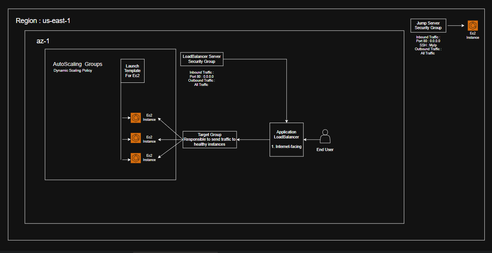
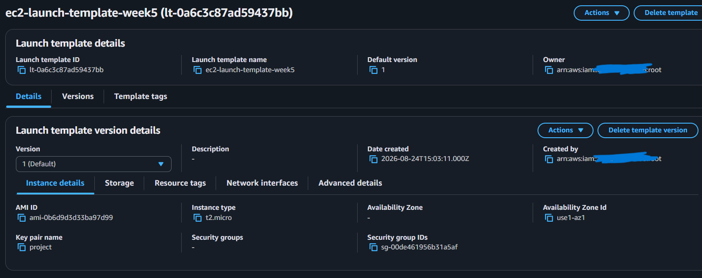
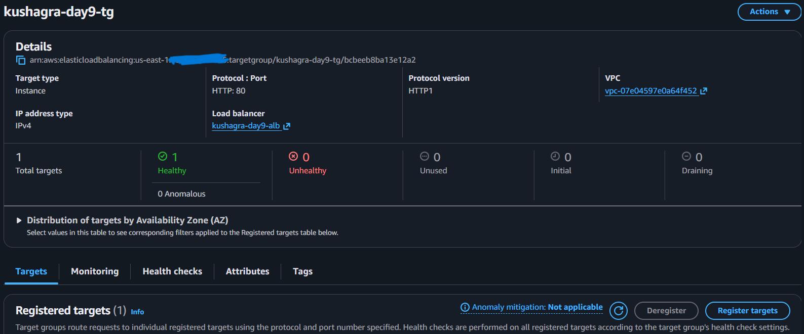
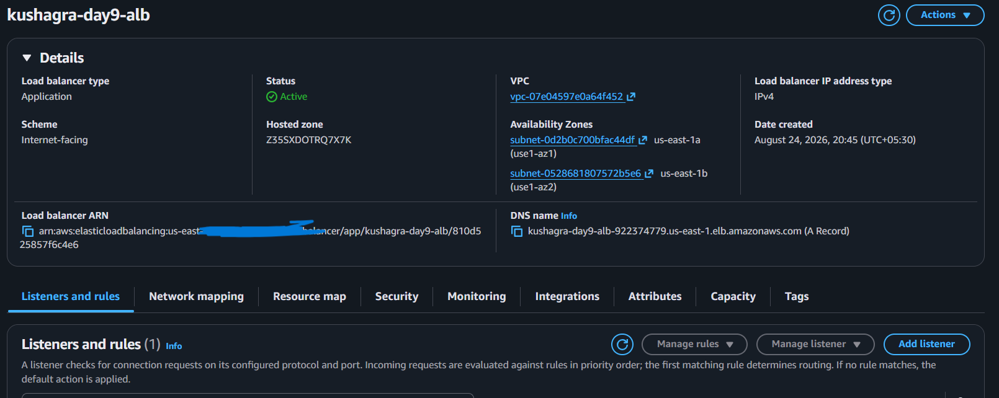
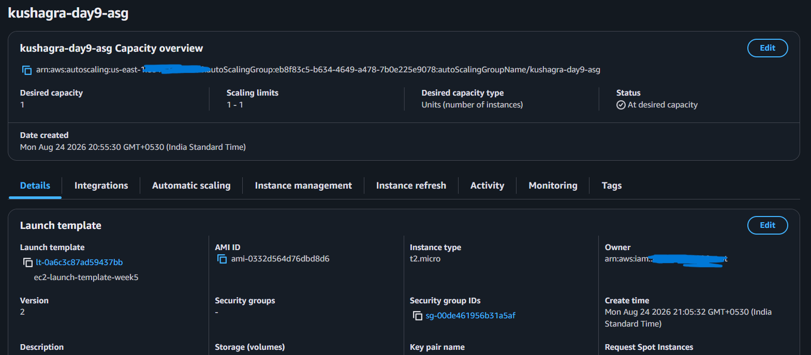
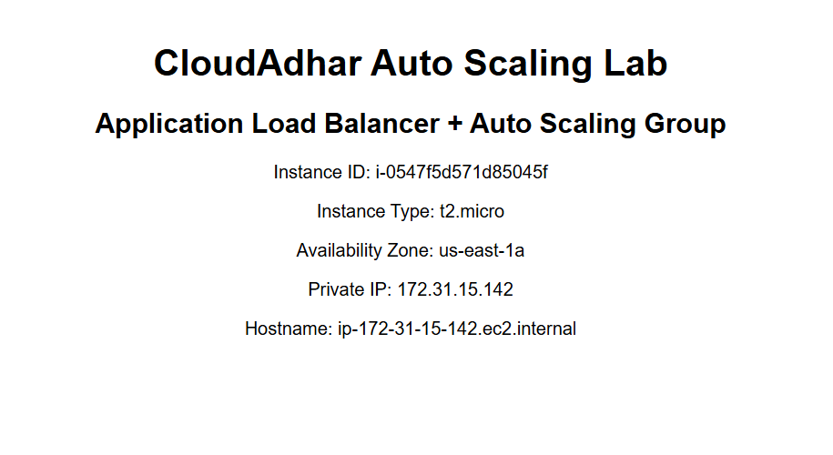

# Week 5 - Auto Scaling and Elastic Load Balancing

## Learner
- Name: kushagra ghadigaonkar 
- GitHub: https://github.com/Kushagra-ghadigaonkar/10WeeksOfAWS/tree/main/week-05
- LinkedIn:
- Region: india (mumbai)

## Day 9

```bash
- I have learned about how to create and configure launch template, target group , application load balancer , auto scaling group in aws
- learned about different types of load balancer 

```

## Overall Architecture


### Screenshots :

1. Launch template : 


2. Target Group : 


3. Load Balancer :


4. AutoScalingGroup :


5. Final Ec2 instance output :


## Day 10

```bash
- Currently i dont have domain that's why i am not going to do day 10 lab

- Learned About : how to keep application with 0 downtime
- Blue deployment : its a live production application which is accesseble to users
- Green deployment: its a newly updated version of application which is currently in testing phase when it would be verified to be perfect    then it will change from green to blue deployment
```